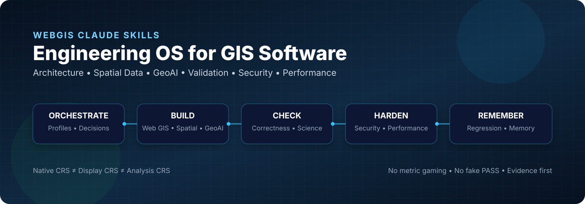
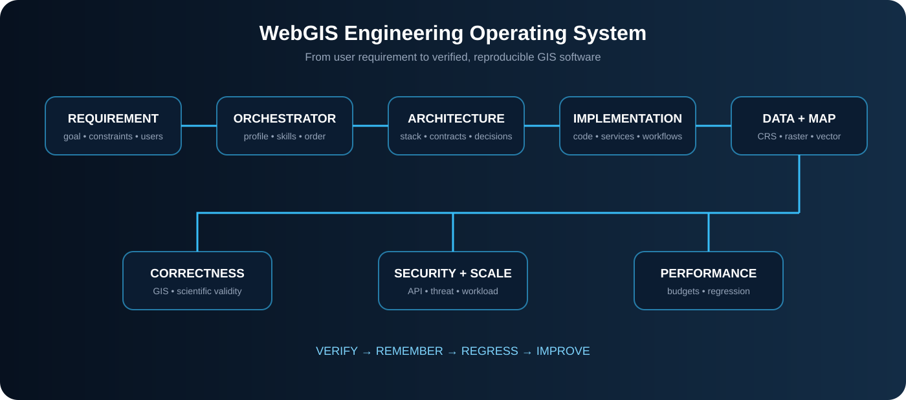
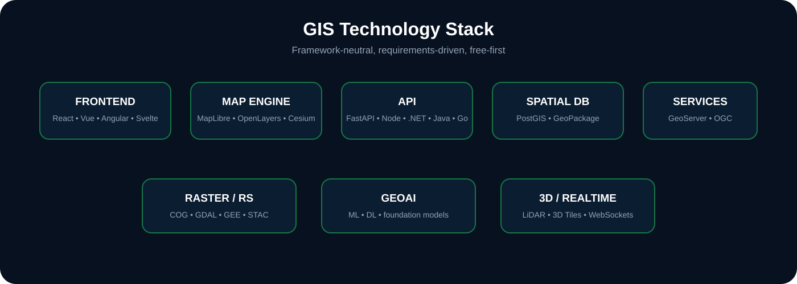
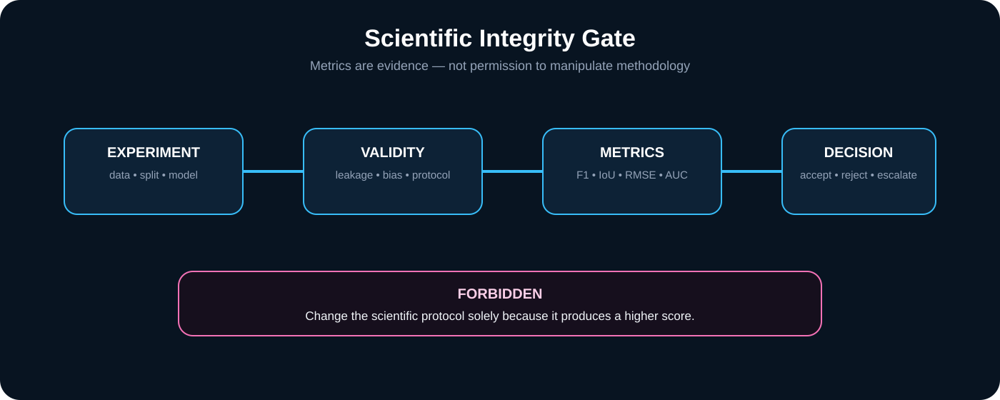

<div align="center">

# WebGIS Claude Skills

### The engineering operating system for GIS software, GeoAI & spatial applications

<p>
  <a href="https://github.com/Muhammad-Tariq/webgis-claude-skills"></a>
  <a href="https://github.com/Muhammad-Tariq/webgis-claude-skills/blob/main/LICENSE"></a>
  <a href="https://github.com/Muhammad-Tariq/webgis-claude-skills"></a>
</p>

<p>
  <b>Architecture</b> · <b>GeoAI</b> · <b>Remote Sensing</b> · <b>PostGIS</b> · <b>GeoServer</b> · <b>OGC</b> · <b>3D GIS</b> · <b>Testing</b> · <b>Security</b> · <b>Performance</b> · <b>Evidence-Driven Learning</b>
</p>

</div>

---

## What is this?

**WebGIS Claude Skills** is a repository-backed engineering skill system for building reliable GIS software with AI coding agents.

It is designed to help an agent move from:

**Requirement → Architecture → Design → Data Contracts → Implementation → Validation → Security → Performance → Documentation → Persistent Memory**

The goal is not simply to generate GIS code. The goal is to make the agent reason about **spatial correctness, scientific validity, scalability, security, cost, reproducibility, production operations, and validated learning**.

### Why it exists

GIS applications fail in ways that ordinary software assistants often miss:

- incorrect CRS or measurement assumptions
- invalid geometry and raster misalignment
- spatial/temporal leakage in GeoAI
- huge GeoJSON payloads and browser overload
- unbounded spatial APIs
- insecure GeoServer/OGC exposure
- provider-secret leakage
- expensive cloud choices without requirements
- scientifically invalid methodology chosen because it improves a metric

This repository turns those concerns into **skills, contracts, anti-patterns, decision matrices, fixtures, executable evaluations, persistent project memory, and a controlled evidence-driven learning pipeline**.

---

## Visual workflow

<p align="center">
  
</p>

> The visual is intentionally part of the repository homepage so the project communicates its architecture before a visitor reads the details.

---

## Visual architecture

<p align="center">
  
</p>

## GIS technology stack

<p align="center">
  
</p>

## Scientific integrity

<p align="center">
  
</p>

## Engineering loop

```text
                        USER REQUIREMENT
                               │
                               ▼
                    ┌────────────────────┐
                    │ PROJECT ORCHESTRATOR│
                    └──────────┬─────────┘
                               │
              ┌────────────────┼────────────────┐
              ▼                ▼                ▼
        ARCHITECTURE       DESIGN SYSTEM    DATA CONTRACTS
              │                │                │
              └────────────────┼────────────────┘
                               ▼
                        IMPLEMENTATION
                               │
                               ▼
                    ┌────────────────────┐
                    │ QUALITY EVALUATION │
                    ├────────────────────┤
                    │ GIS Correctness    │
                    │ Scientific Integrity│
                    │ API / Security     │
                    │ Scalability        │
                    │ Performance        │
                    │ Regression         │
                    └──────────┬─────────┘
                               ▼
                         VERIFIED STATE
                               │
                               ▼
                        PROJECT MEMORY
```

---

## Core capabilities

| Capability | Purpose |
|---|---|
| **Project Orchestrator** | Classify projects, select skills, order work, and enforce gates |
| **Project Memory** | Resume interrupted work from the last verified state |
| **Evidence-Driven Learning** | Turn sanitized recurring project evidence into validated, versioned repository knowledge |
| **Software Engineering** | Architecture, modularity, APIs, resilience, testing, documentation |
| **Web GIS** | Frontend, map engines, GIS UX, APIs, spatial services |
| **PostGIS / GeoServer** | Spatial data modeling, indexing, OGC services, publishing |
| **Remote Sensing / GEE** | Satellite processing, temporal analysis, reproducible workflows |
| **GeoAI** | Spatial ML, foundation models, leakage controls, deployment |
| **GIS Correctness** | CRS, units, geometry, raster alignment, analytical validity |
| **Security** | Threat modeling, access control, resource protection, secrets |
| **Performance** | Measured budgets, profiling, large-data strategies, regression |
| **Evaluation Harness** | Deterministic cases, adapters, PASS/FAIL/BLOCKED/ESCALATE |
| **Anti-Pattern Remediation** | Detect → explain → correct → validate → regression-protect |

---

## Scientific integrity details

A core rule of the system is:

> **The system must never modify scientific methodology merely to artificially improve model metrics.**

A higher F1, IoU, accuracy, R², or other score does not automatically mean a better model when the evaluation protocol changed or became less valid.

The system instead records:

- methodology
- scientific rationale
- evaluation protocol
- dataset/model versions
- before/after metrics
- validation evidence
- experiment lineage

Ambiguous methodology changes are escalated rather than silently accepted.

---


## Evidence-driven learning

The repository can evolve from experience across many projects without treating GitHub as a raw memory database.

The controlled model is:

Project memory
→ Sanitized observation
→ Learning candidate
→ Deduplication / aggregation
→ Privacy + generalization checks
→ Validation / regression
→ Versioned repository knowledge

**Project memory stays project-scoped by default.** Raw conversations, private source code, proprietary datasets, secrets, customer data, and sensitive locations are not repository learning inputs.

A new observation must not silently overwrite an existing skill. If it belongs to an existing capability, the skill evolves through a versioned, validated change. A separate skill is created only when the responsibility is genuinely distinct.

See learning/README.md, learning/schema.md, learning/PRIVACY.md, and learning/contribution-protocol.md.\n\nThe contribution boundary is **local-only by default**. Explicit opt-in is required before sanitized evidence may leave a project boundary. Contribution manifests are deterministically validated in CI; a valid manifest is still not accepted repository knowledge.

## CRS intelligence

The system explicitly separates:

**Native CRS ≠ Display CRS ≠ Analysis CRS**

This allows datasets with different native coordinate reference systems to coexist in the same map without mutating their source data.

Permanent reprojection is treated as a deliberate data transformation, not a side effect of visualization.

---

## Evaluation architecture

The repository includes executable evaluation building blocks for:

```text
CRS
 ↓
Geometry
 ↓
Raster
 ↓
GeoAI
 ↓
Scientific Integrity
 ↓
Web GIS Scalability
 ↓
Spatial API
 ↓
Security
 ↓
Performance
 ↓
Learning Safety
 ↓
Regression
```

Evaluation results distinguish:

- **PASS**
- **FAIL**
- **BLOCKED**
- **ESCALATE**

A plausible patch is never treated as verified without the required validation.

---

## Anti-pattern remediation

The system is designed to do more than document bad patterns.

```text
Anti-pattern
     ↓
Detection
     ↓
Classification
     ↓
Explain risk
     ↓
Select correct pattern
     ↓
Auto-fix when safe
     ↓
Validate
     ↓
Regression protection
```

Examples include:

- giant GeoJSON
- client-side million-feature overload
- unbounded spatial queries
- degree-based planar distance
- mixed-CRS analysis
- raster grid misalignment
- spatial ML leakage
- temporal leakage
- provider secrets in the browser
- unrestricted WFS
- raster full-download workflows
- map reinitialization
- N+1 spatial requests

---

## Repository structure

```text
webgis-claude-skills/
├── skills/
│   ├── core/
│   ├── webgis/
│   ├── spatial/
│   ├── remote-sensing/
│   ├── geoai/
│   ├── 3d/
│   ├── desktop/
│   ├── realtime/
│   ├── infrastructure/
│   ├── quality/
│   └── scientific-integrity/
├── profiles/
├── decision-matrices/
├── contracts/
├── anti-patterns/
├── fixtures/
├── evals/
├── learning/
├── templates/
└── project-memory/
```

> The repository currently keeps proven existing paths stable while the broader target architecture is established through compatible additions rather than a risky bulk reorganization.

---

## Project profiles

The orchestrator can classify work as:

- Web GIS application
- GIS portal
- GeoAI platform
- Remote-sensing platform
- GIS dashboard
- Desktop GIS
- GIS API/service
- GIS data pipeline
- 3D GIS
- Real-time GIS
- Enterprise GIS
- Scientific/research GIS
- Commercial GIS SaaS

Hybrid projects are supported.

---

## Technology selection

The system does not hard-code a single framework.

Technology choices are requirements-driven and can evaluate, where relevant:

**Frontend:** React/Vite, Next.js, Vue/Nuxt, Angular, Svelte/SvelteKit

**Maps:** MapLibre GL JS, OpenLayers, Leaflet, Cesium

**Backend:** FastAPI/Python, Node/TypeScript, .NET, Java/Spring, Go

**Spatial database:** PostGIS, SQLite/GeoPackage

**Raster:** COG/GDAL, object storage, STAC, raster services

**Point cloud:** LAS/LAZ, COPC, PDAL, 3D Tiles

**Deployment:** VPS, containers, managed infrastructure, Kubernetes, on-premises, hybrid

The decision engine records constraints, alternatives, evidence, cost/licensing implications, and exit considerations.

---

## Free-first and licensing

The default policy is:

> **Use the best viable free/open-source option first.**

Paid services are considered when a concrete requirement justifies them, such as scale, SLA, proprietary data, production GPU throughput, or managed reliability.

This repository is licensed under **Apache License 2.0**.

Third-party components, if incorporated later, should retain their original license and attribution requirements.

---

## Installation for coding agents

The repository can be installed into an existing code project without requiring Python for the **skill distribution layer**.

### npm — recommended for permanent CLI installation

For a normal persistent installation, use npm:

```bash
npm install -g webgis-claude-skills
webgis-claude-skills install --agent all
```

Update later with:

```bash
npm update -g webgis-claude-skills
webgis-claude-skills update --agent all
```

### npx — recommended for one-off execution

Once the npm package is published:

```bash
npx webgis-claude-skills install --agent all
```

Until the public npm package is published, the same CLI can be run directly from this GitHub repository:

```bash
npx github:Muhammad-Tariq/webgis-claude-skills install --agent all
```

Install for one client:

```bash
npx webgis-claude-skills install --agent claude
npx webgis-claude-skills install --agent codex
npx webgis-claude-skills install --agent cursor
npx webgis-claude-skills install --agent opencode
```

Install the complete repository support bundle:

```bash
npx webgis-claude-skills install --full
```

### Optional Python GIS environment

The npm installer has two modes. The default is lightweight and does not install Python GIS libraries:

```bash
npm install -g webgis-claude-skills
webgis-claude-skills install --agent all
```

For GIS development, opt into a managed Python virtual environment:

```bash
webgis-claude-skills install --agent all --with-gis
```

This creates an isolated `.webgis-claude-skills/venv/` and installs:

**NumPy · Pandas · Shapely · PyProj · GeoPandas · Rasterio**

The managed environment keeps the user's existing Python projects untouched. Advanced users can explicitly use their existing system Python instead:

```bash
webgis-claude-skills install --agent all --with-gis --python-system
```

The same options work through npx:

```bash
npx webgis-claude-skills install --agent all --with-gis
```

Verify the installation:

```bash
npx webgis-claude-skills verify
npx webgis-claude-skills doctor
```

Update later:

```bash
npx webgis-claude-skills update --agent all
```

The installer supports the portable `.agents/skills/` layout plus native/compatible locations for Claude Code, Cursor, and OpenCode. Codex uses the `.agents/skills/` project location. The compatibility registry is maintained in [`integrations/agent-support.json`](integrations/agent-support.json).

### Python / GIS runtime

Python is intentionally separate from the npm skill distribution. Use Python when the project or contribution needs GIS/scientific processing, evaluation, GDAL, or remote-sensing tooling.

The standard GIS extra provides **NumPy, Pandas, Shapely, PyProj, GeoPandas, and Rasterio**.

Python remains fully supported. Once the PyPI package is published:

```bash
python -m pip install webgis-claude-skills
webgis-claude-skills install --agent all
```

For repository development:

```bash
python -m pip install -e .
```

Optional GIS/GDAL/remote-sensing environments:

```bash
python -m pip install "webgis-claude-skills[gis]"
python -m pip install "webgis-claude-skills[gdal]"
python -m pip install "webgis-claude-skills[remote-sensing]"
```

The npm layer does **not** require Python. Python is available when the project needs a Python runtime, the repository evaluation harness, GDAL, GeoPandas, Rasterio, Shapely, PyProj, Earth Engine, or other Python tooling.

See [Installation](docs/installation.md) for the complete distribution architecture.

---

## Using the skills

The repository is intended for coding-agent workflows that can read repository files and skills.

A typical session follows:

```text
1. Load project memory
2. Classify the project
3. Select relevant skills
4. Resolve architecture / technology gates
5. Inspect the existing implementation
6. Implement the smallest coherent change
7. Run domain + correctness + security + performance checks
8. Run relevant evaluation cases
9. Record the verified state
10. Optionally derive sanitized learning candidates
11. Commit and continue from the exact next action
```

---

## Current evaluation adapters

- CRS metadata/invariant checks
- Geometry fixture checks
- Raster metadata/alignment checks
- GeoAI experiment/leakage checks
- Web GIS scalability checks
- Spatial API/security checks
- Performance budget/regression checks

Learning safety currently has a deterministic contract case covering unvalidated automatic promotion. Runtime aggregation/telemetry is intentionally not enabled by this repository.

The harness deliberately refuses to claim numerical correctness when a real computational engine is required but not executed.

---

## Roadmap

### Foundation
- [x] Repository-backed project memory
- [x] Project orchestrator
- [x] Software engineering foundation
- [x] GIS correctness gate
- [x] Technology decision engine
- [x] Project profiles
- [x] Data contracts
- [x] Golden GIS fixtures
- [x] Evidence-driven learning boundary

### Domain engineering
- [x] Web GIS architecture/frontend/map engine/UX
- [x] PostGIS
- [x] GeoServer
- [x] Spatial APIs
- [x] Remote sensing / GEE
- [x] GeoAI
- [x] Raster / LiDAR / 3D / OGC
- [x] Desktop / real-time
- [x] DevOps / observability / performance

### Quality and research integrity
- [x] Anti-pattern remediation
- [x] Executable evaluation harness
- [x] Scientific integrity gate
- [x] Scalability evaluation
- [x] API/security evaluation
- [x] Performance regression checks
- [x] Learning safety case
- [ ] Unified evaluation command with pluggable runtime adapters
- [x] Learning candidate validator
- [x] Optional privacy-safe contribution protocol
- [ ] CI regression execution for deterministic cases
- [ ] Repository health dashboard
- [ ] Public skill/version manifest
- [ ] Release automation

---

## Community & contribution

This project is open to community contributions.

**Start here:**

- [Contribution guide](CONTRIBUTING.md) — workflow, validation, privacy, and licensing
- [Community guide](docs/community.md) — contributor onboarding and recognition
- [Bug report](https://github.com/Muhammad-Tariq/webgis-claude-skills/issues/new?template=bug_report.yml)
- [Feature request](https://github.com/Muhammad-Tariq/webgis-claude-skills/issues/new?template=feature_request.yml)
- [Security policy](SECURITY.md) — private vulnerability reporting

The repository accepts durable contributions such as skills, project profiles, decision matrices, contracts, evaluation cases, fixtures, security/performance checks, documentation, and privacy-safe learning artifacts.

Community contributions follow the same engineering quality gates as the repository itself: provenance, deterministic validation where practical, CI, licensing, privacy, security, and scientific-integrity requirements.

See [AUTHORS.md](AUTHORS.md) for project authorship and attribution.

---

## Contributing

Contributions should add durable engineering value.

When adding a skill, contract, anti-pattern, fixture, evaluation, or learning candidate:

1. define the problem and scope
2. add deterministic validation where possible
3. document assumptions and failure modes
4. preserve licensing and provenance
5. avoid secrets and private project data
6. keep learning candidates non-authoritative until validated
7. update project memory
8. verify before claiming completion

---

## License

Apache License 2.0. See [LICENSE](LICENSE).

---

<div align="center">

**Built for serious GIS engineering with coding agents.**

**Project author: Tariq Azam**

[Authors & Attribution](AUTHORS.md) · [Contributing](CONTRIBUTING.md) · [Community Guide](docs/community.md)

[Repository](https://github.com/Muhammad-Tariq/webgis-claude-skills)

</div>
